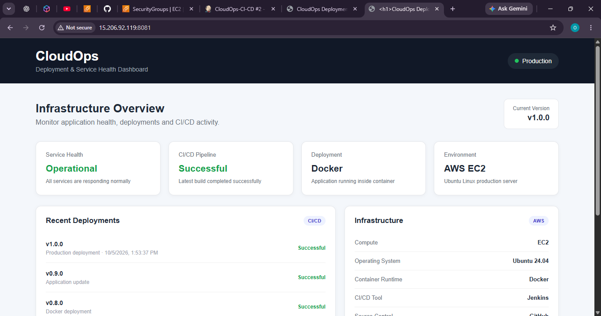
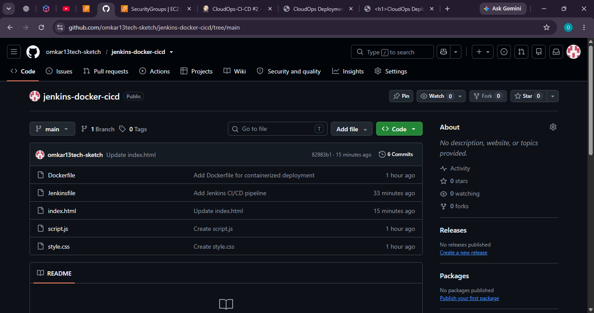
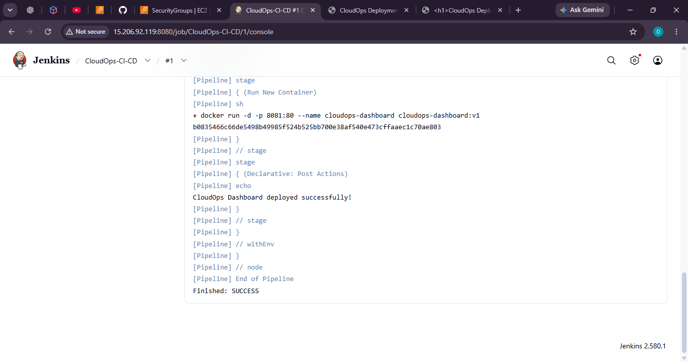
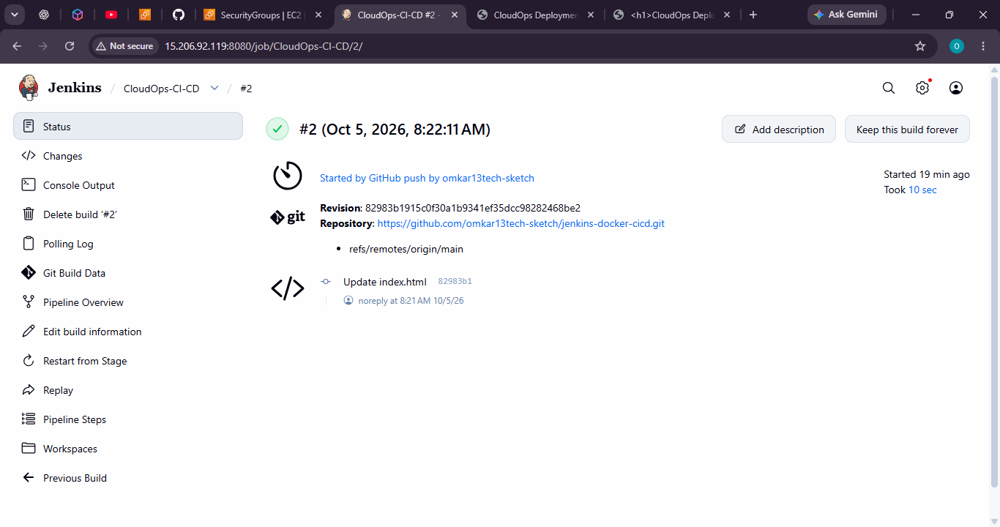
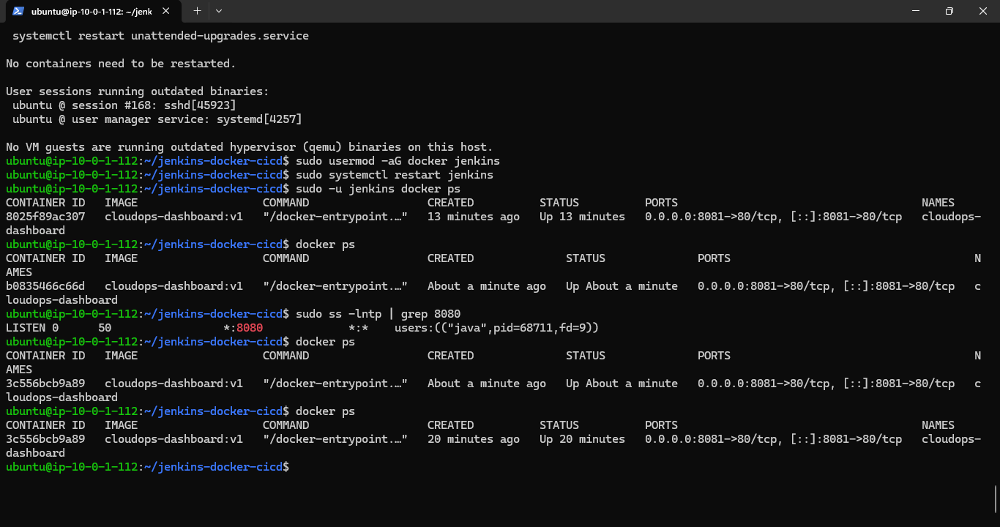

# ☁️ CloudOps Deployment Dashboard

A containerized deployment and service health dashboard deployed on **AWS EC2** using an automated **GitHub → Jenkins → Docker CI/CD pipeline**.

---

## 📌 Project Overview

**CloudOps Deployment Dashboard** is a practical DevOps project built to demonstrate an automated application deployment workflow.

The project integrates **GitHub, Jenkins, Docker, and AWS EC2** to create a simple end-to-end CI/CD pipeline.

Whenever a code change is pushed to the GitHub repository, a **GitHub Webhook** triggers Jenkins. Jenkins then builds a new Docker image, replaces the existing container, and deploys the updated application on the AWS EC2 server.

### 🔄 End-to-End Flow

```text
Developer
    ↓
GitHub Repository
    ↓
GitHub Webhook
    ↓
Jenkins Pipeline
    ↓
Docker Image
    ↓
Docker Container
    ↓
AWS EC2
    ↓
CloudOps Dashboard
```

---

## 🎯 Project Objective

The main objective of this project was to understand and implement a basic automated **CI/CD deployment pipeline** using commonly used DevOps technologies.

The pipeline automates:

* Source code integration
* CI/CD pipeline triggering
* Docker image creation
* Existing container replacement
* Application deployment
* Deployment verification

---

## 🛠️ Technologies Used

| Technology       | Purpose                      |
| ---------------- | ---------------------------- |
| **Git & GitHub** | Source Code Management       |
| **Jenkins**      | CI/CD Automation             |
| **Docker**       | Application Containerization |
| **AWS EC2**      | Application Hosting          |
| **Ubuntu Linux** | Server Operating System      |
| **Nginx**        | Web Server inside Docker     |

---

## 🏗️ Architecture

```text
                    ┌─────────────────┐
                    │    Developer    │
                    └────────┬────────┘
                             │
                             │ Push Code
                             ↓
                    ┌─────────────────┐
                    │     GitHub      │
                    │   Repository    │
                    └────────┬────────┘
                             │
                             │ Webhook
                             ↓
                    ┌─────────────────┐
                    │     Jenkins     │
                    │  CI/CD Pipeline │
                    └────────┬────────┘
                             │
                             │ Docker Build
                             ↓
                    ┌─────────────────┐
                    │  Docker Image   │
                    └────────┬────────┘
                             │
                             │ Deploy
                             ↓
              ┌─────────────────────────────┐
              │          AWS EC2            │
              │                             │
              │     ┌─────────────────┐     │
              │     │ Docker Container│     │
              │     │ cloudops-       │     │
              │     │ dashboard       │     │
              │     └────────┬────────┘     │
              │              │              │
              └──────────────┼──────────────┘
                             ↓
                  CloudOps Dashboard
```

---

## 🔄 CI/CD Pipeline

### 1️⃣ Developer Push

Application source code is committed and pushed to the GitHub repository.

### 2️⃣ GitHub Webhook

GitHub sends a webhook notification to Jenkins whenever a new push is made to the repository.

### 3️⃣ Jenkins Trigger

Jenkins automatically starts the configured pipeline.

### 4️⃣ Checkout

Jenkins checks out the latest source code from the GitHub repository.

### 5️⃣ Docker Build

Jenkins builds a Docker image using the project's `Dockerfile`.

```bash
docker build -t cloudops-dashboard:v1 .
```

### 6️⃣ Stop Existing Container

The currently running application container is stopped.

```bash
docker stop cloudops-dashboard
```

### 7️⃣ Remove Existing Container

The previous container is removed.

```bash
docker rm cloudops-dashboard
```

### 8️⃣ Deploy New Container

A new container is started using the newly built Docker image.

```bash
docker run -d -p 8081:80 --name cloudops-dashboard cloudops-dashboard:v1
```

### 9️⃣ Application Deployment

The updated application becomes available through the AWS EC2 server.

---

## 🐳 Docker Implementation

The application is packaged into a Docker image and deployed as a Docker container.

### Docker Image

```text
cloudops-dashboard:v1
```

### Container

```text
cloudops-dashboard
```

### Port Mapping

```text
EC2 Port 8081 → Container Port 80
```

The container runs the dashboard using **Nginx** as the web server.

---

## ⚙️ Jenkins Pipeline

The CI/CD pipeline is defined using a `Jenkinsfile`.

Pipeline stages:

```text
Checkout
   ↓
Docker Build
   ↓
Stop Old Container
   ↓
Run New Container
```

Jenkins is configured to receive GitHub webhook events and automatically execute the pipeline after a repository push.

---

## ☁️ AWS EC2 Deployment

The application is deployed on an **AWS EC2** instance running **Ubuntu Linux**.

The EC2 environment contains:

* Jenkins
* Docker
* CloudOps Dashboard container

The application is exposed through port **8081**.

---

## 📸 Project Screenshots

### 1. CloudOps Dashboard



---

### 2. GitHub Repository



---

### 3. Jenkins Successful Pipeline



---

### 4. Automatic Jenkins Build



---

### 5. Docker Container Running on EC2



---

## 🚀 Deployment Flow

```text
GitHub Push
     ↓
GitHub Webhook
     ↓
Jenkins
     ↓
Checkout Source Code
     ↓
Docker Build
     ↓
Stop Existing Container
     ↓
Remove Existing Container
     ↓
Run New Container
     ↓
AWS EC2 Deployment
     ↓
CloudOps Dashboard
```

---

## 📂 Project Structure

```text
jenkins-docker-cicd/
│
├── Dockerfile
├── Jenkinsfile
├── index.html
├── script.js
├── style.css
├── README.md
│
└── screenshots/
    ├── dashboard.png
    ├── github-repository.png
    ├── jenkins-success.png
    ├── jenkins-automatic-build.png
    ├── docker-container.png
    └── .gitkeep
```

---

## 📚 DevOps Concepts Practiced

Through this project, I practiced:

* Git and GitHub
* GitHub Webhooks
* Jenkins
* Jenkins Pipeline
* Jenkinsfile
* CI/CD automation
* Dockerfile
* Docker Images
* Docker Containers
* Linux server administration
* AWS EC2 deployment
* Jenkins and Docker integration
* Automated application deployment

---

## ✅ Project Outcome

Successfully implemented an automated CI/CD workflow where a code change pushed to GitHub triggers Jenkins and results in a new Docker-based deployment on an AWS EC2 server.

### Final CI/CD Workflow

**GitHub → Jenkins → Docker → AWS EC2**

---

## 👨‍💻 Project

**CloudOps Deployment Dashboard**

Built using:

**GitHub • Jenkins • Docker • AWS EC2 • Ubuntu Linux • Nginx**

---
